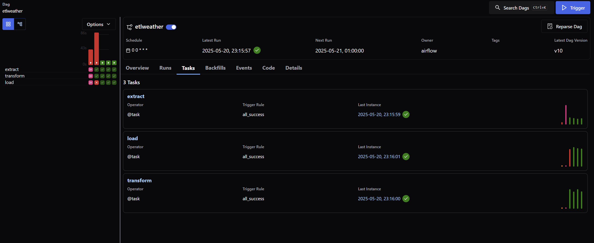
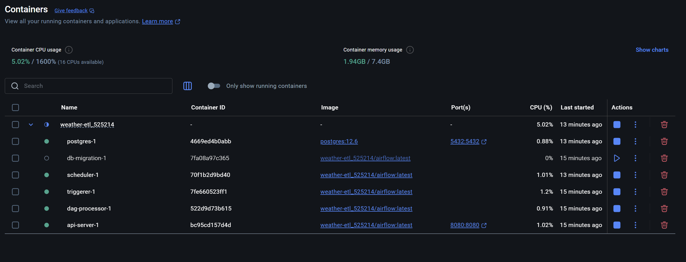
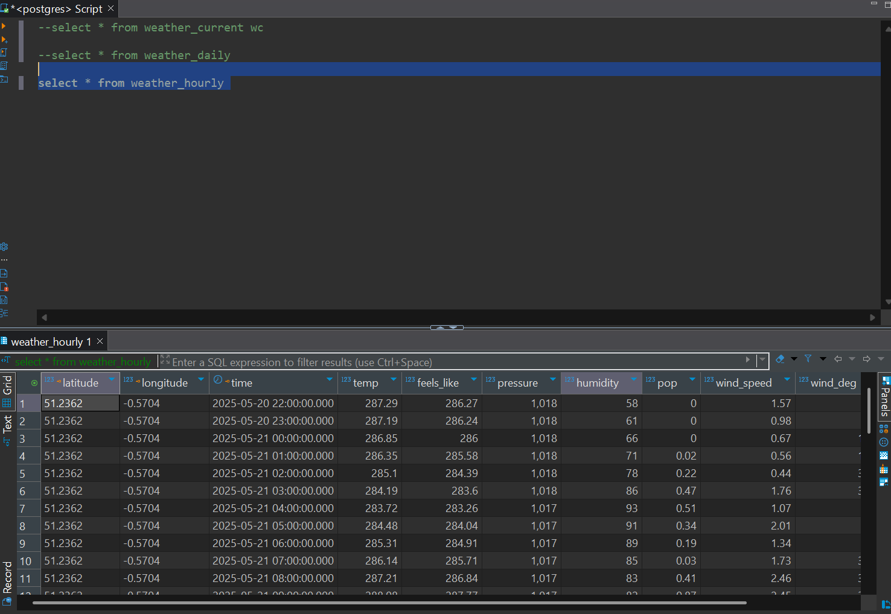

# Weather ETL Pipeline



## Overview

This **Weather ETL project** is a personal project to demonstrate data engineering and ETL pipeline skills. The pipeline gathers weather data from the OpenWeather API, transforms the data, and loads it into a **PostgreSQL** database using **Apache Airflow**, **Astro**, and Docker.  
It's designed as a resume piece to showcase workflow orchestration, data extraction, transformation, loading, and modern engineering practices.

---

## Table of Contents

- [Features](#features)
- [Tech Stack](#tech-stack)
- [Architecture](#architecture)
- [Project Structure](#project-structure)
- [Getting Started](#getting-started)
- [Airflow/Docker Screenshots](#screenshots)
- [Configuration](#configuration)
- [Contributing](#contributing)
- [License](#license)

---

## Features

- **Automated ETL pipeline**: Orchestrated with Airflow
- **API Data Extraction**: Gathers weather info from OpenWeather
- **Data Transformation**: Cleans and transforms JSON data
- **PostgreSQL Data Load**: Saves data in a persistent, queryable format
- **Dockerized**: Easily reproducible and portable
- **Highly Configurable**: Modify cities, schedule, or endpoints from config files

---

## Tech Stack

| Component           | Purpose                          |
|---------------------|----------------------------------|
| **Astro**           | Orchestration & project templating|
| **Apache Airflow**  | ETL scheduling and management    |
| **PostgreSQL**      | Data storage                     |
| **Docker**          | Containerization                 |
| **OpenWeather API** | Data source                      |
| **Python**          | All ETL scripting                |

---

## Architecture

1. **Extract**: Use OpenWeather API to get current weather for specified locations.
2. **Transform**: Clean and reshape raw API responses into tabular data.
3. **Load**: Store weather metrics and metadata into PostgreSQL.
4. **Orchestrate**: Use Airflow DAG to automate and monitor the entire pipeline.




---

## Project Structure

```
.
├── .astro/
│   ├── config.yaml
│   ├── dag_integrity_exceptions.txt
│   └── test_dag_integrity_default.py
├── dags/
│   └── etlweather.py         # Main ETL DAG
│   └── docker-compose.yml
├── include/
├── plugins/
├── Dockerfile
├── requirements.txt
├── packages.txt
├── .env
├── LICENSE
├── *.png                    # Project screenshots
```

---

## Getting Started

### 1. Prerequisites

- Docker + Docker Compose installed
- OpenWeather API key ([Get a free key here](https://openweathermap.org/api))

### 2. Clone the repository

```bash
git clone https://github.com/your-username/weather_etl.git
cd weather_etl
```

### 3. Environment Variables

Create a `.env` file in the root:

```
OPENWEATHER_API_KEY=your_api_key
```

### 4. Build and start the stack

```bash
docker-compose up --build
```

Astro will spin up Airflow, Postgres, and all dependencies.

### 5. Airflow UI

- Access Airflow at http://localhost:8080  
- The DAG should appear as `etlweather`. Trigger or schedule as needed.

---

## Configuration

- **Change locations, schedules, or connection settings** via `.astro/config.yaml` or environment variables.
- DAG schedule and logic in `dags/etlweather.py`.

---

## Screenshots

- **DAG_SC.png** – Airflow DAG pipeline
- **Docker_SC.png** – Docker/Container status
- **DB_test.png** – Postgres data validation

---

## License

This project is licensed under the MIT License. See the [LICENSE](LICENSE) file for details.

---

### Summary

- **Fully automated, containerized ETL pipeline** for weather analytics.
- Powered by Docker, Airflow, and Astro for orchestration; Postgres for storage.
- Easily extensible: add more data sources, schedule intervals, or analytics steps.

---

**Questions or Suggestions?**  
Open an issue or contact me directly!
```
